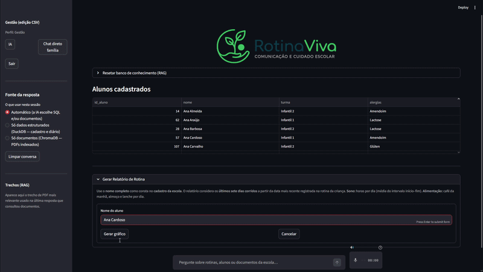

# Olá, eu sou o Leonardo Campos! 👋

### Projeto em Destaque: Rotina Viva 🚀
Este é um sistema de gestão escolar com IA que desenvolvi para automatizar processos pedagógicos.

)

*Clique na imagem acima para ver o código completo do projeto.*
